# The Absolute Beginner's Guide to Passing the AWS SAA-C03 Exam

## 1. Introduction to the AWS Certified Solutions Architect - Associate (SAA-C03) Exam

The AWS Certified Solutions Architect - Associate (SAA-C03) exam is a highly sought-after certification designed for individuals who possess the skills and knowledge to design and implement distributed systems on Amazon Web Services (AWS). This certification validates a candidate's ability to architect secure, resilient, high-performing, and cost-optimized solutions. It is consistently ranked among the top-paying and most in-demand IT certifications globally, making it a significant milestone for professionals aiming to advance their careers in cloud computing . The exam is not just a theoretical test; it focuses on real-world scenarios and practical application of AWS services, ensuring that certified individuals can solve complex business challenges using the AWS platform . The SAA-C03 version of the exam was updated to reflect the latest AWS services and best practices, ensuring that the certification remains relevant and valuable in the rapidly evolving cloud landscape .

### 1.1. Exam Overview and Key Details

The SAA-C03 exam is a comprehensive assessment that evaluates a candidate's ability to design solutions based on the AWS Well-Architected Framework. It is an intermediate-level certification that requires a solid understanding of AWS services and their practical applications. The exam is designed to be challenging, but with the right preparation and a structured study plan, it is achievable for dedicated individuals. The exam is delivered through Pearson VUE and PSI, and candidates can choose to take it at a testing center or as an online proctored exam . The cost of the exam is **$150 USD**, and it is recommended that candidates have at least one year of experience with AWS technologies and services before attempting the exam . The exam is scored on a scale of 100 to 1000, with a minimum passing score of **720** . It is important to note that the exam uses a compensatory scoring model, which means that you do not need to pass each section individually; you only need to achieve a passing score on the overall exam .

#### 1.1.1. Exam Code and Version

The official exam code for the AWS Certified Solutions Architect - Associate certification is **SAA-C03** . This version represents the latest update to the certification, succeeding the previous SAA-C02 version. The SAA-C03 exam was introduced to align with the rapid evolution of AWS services and to reflect the current best practices in cloud architecture. While the core domains of the exam have remained largely consistent, there have been notable changes in the emphasis on certain topics. The most significant change in the SAA-C03 version is the increased focus on security, with the "Design Secure Architectures" domain now accounting for **30%** of the exam content . This makes it the largest and most critical domain in the exam. The other domains, including "Design Resilient Architectures," "Design High-Performing Architectures," and "Design Cost-Optimized Architectures," have also been updated to include newer services and architectural patterns . It is crucial for candidates to prepare specifically for the SAA-C03 version, as the exam content and question styles have been refined to test a deeper understanding of modern cloud architecture principles.

#### 1.1.2. Duration and Question Format

The AWS Certified Solutions Architect - Associate (SAA-C03) exam consists of **65 questions** that must be completed within a **130-minute** time frame . This gives candidates an average of two minutes per question, which requires efficient time management and a solid understanding of the exam material. The questions are presented in a **multiple-choice and multiple-response format** . Multiple-choice questions have one correct answer out of four options, while multiple-response questions require the candidate to select two or more correct answers from a list of options. The exam is designed to be challenging, with scenario-based questions that test the candidate's ability to apply their knowledge to real-world architectural problems. These scenarios often describe a specific business requirement or a technical challenge, and the candidate must choose the most appropriate AWS services and architectural patterns to address the situation. It is important to note that the exam includes **15 unscored questions** that are used by AWS to gather data for future exams. These unscored questions are not identified during the exam and do not affect the candidate's final score .

#### 1.1.3. Scoring Model and Passing Score

The AWS Certified Solutions Architect - Associate (SAA-C03) exam is scored on a scale of 100 to 1000, with a **passing score of 720** . The scoring model is based on a statistical analysis of the exam results, and the passing score is set to ensure that candidates have demonstrated a sufficient level of competency in the subject matter. The exam uses a scaled scoring system, which means that the raw score (the number of questions answered correctly) is converted to a scaled score. This is done to account for slight variations in the difficulty of different versions of the exam. The passing score of 720 is a fixed standard, and it does not change based on the performance of other candidates. It is important to note that there is **no penalty for guessing**, so it is always better to answer a question than to leave it blank. The exam results are reported as a pass or fail, along with a score report that provides a breakdown of the candidate's performance in each of the four domains. This feedback can be useful for identifying areas of weakness and for preparing for a retake if necessary.

#### 1.1.4. Prerequisites and Recommended Experience

While there are no formal prerequisites for taking the AWS Certified Solutions Architect - Associate (SAA-C03) exam, AWS recommends that candidates have at least **one year of hands-on experience** in designing and implementing distributed systems on AWS . This experience is crucial for understanding the practical aspects of cloud architecture and for being able to apply the theoretical knowledge to real-world scenarios. The exam is designed to test a candidate's ability to make sound architectural decisions, and this requires a deep understanding of how different AWS services work together. For absolute beginners, it is highly recommended to start with the AWS Certified Cloud Practitioner (CLF-C02) certification, which provides a foundational understanding of AWS cloud concepts and services. This can be a good stepping stone to the more advanced Solutions Architect - Associate certification. In addition to hands-on experience, candidates should also have a strong understanding of networking, security, and database concepts. The exam covers a wide range of topics, and a solid foundation in these areas is essential for success.

### 1.2. Understanding the Exam Structure

The AWS Certified Solutions Architect - Associate (SAA-C03) exam is structured around four distinct domains, each representing a critical aspect of cloud architecture. These domains are designed to test a candidate's ability to design and implement solutions that are secure, resilient, high-performing, and cost-optimized. The exam is not just a test of individual service knowledge but a comprehensive assessment of a candidate's ability to integrate various AWS services to meet specific business requirements. The four domains are: **Design Secure Architectures**, **Design Resilient Architectures**, **Design High-Performing Architectures**, and **Design Cost-Optimized Architectures** . Each domain has a specific weighting, which reflects its relative importance in the overall exam. The exam questions are scenario-based, requiring candidates to apply their knowledge to real-world problems. This approach ensures that certified individuals are not just knowledgeable but also capable of making sound architectural decisions in practical situations.

#### 1.2.1. The Four Domains of the SAA-C03 Exam

The AWS Certified Solutions Architect - Associate (SAA-C03) exam is divided into four main domains, each focusing on a specific aspect of cloud architecture. These domains are:

1.  **Design Secure Architectures (30%)** : This is the most heavily weighted domain in the exam, and it focuses on designing secure access to AWS resources, securing workloads and applications, and implementing appropriate data security controls. Key topics include IAM, VPC security, encryption, and compliance .
2.  **Design Resilient Architectures (26%)** : This domain focuses on designing scalable and loosely coupled architectures, as well as highly available and fault-tolerant systems. Key topics include Auto Scaling, load balancing, multi-AZ deployments, and disaster recovery strategies .
3.  **Design High-Performing Architectures (24%)** : This domain focuses on designing high-performing storage, compute, and database solutions. Key topics include S3, EBS, EC2, Lambda, RDS, and DynamoDB .
4.  **Design Cost-Optimized Architectures (20%)** : This domain focuses on designing cost-effective storage, compute, and database solutions. Key topics include S3 lifecycle policies, EC2 pricing models, and cost optimization strategies .

#### 1.2.2. Domain Weightings and Importance

The domain weightings for the AWS Certified Solutions Architect - Associate (SAA-C03) exam are as follows:

| Domain | Weighting |
| :--- | :--- |
| **Design Secure Architectures** | 30% |
| **Design Resilient Architectures** | 26% |
| **Design High-Performing Architectures** | 24% |
| **Design Cost-Optimized Architectures** | 20% |

As the table shows, **Design Secure Architectures** is the most important domain, accounting for nearly a third of the exam content . This highlights the critical importance of security in modern cloud architecture. Candidates should allocate a significant portion of their study time to this domain, ensuring they have a deep understanding of all the security-related topics. The other three domains are also important, and a well-rounded knowledge of all four is necessary to pass the exam. The weightings provide a clear indication of the relative importance of each domain, and they can be used to guide the study plan. It is important to note that the exam is designed to be comprehensive, and questions from all four domains will be interspersed throughout the exam. Therefore, it is not possible to focus on just one or two domains and still pass the exam. A balanced approach that covers all four domains is the key to success.

#### 1.2.3. The Role of the AWS Well-Architected Framework

The AWS Well-Architected Framework is a set of best practices for designing and operating reliable, secure, efficient, and cost-effective systems in the cloud. It is a central theme in the AWS Certified Solutions Architect - Associate (SAA-C03) exam, and a deep understanding of its principles is essential for success. The framework is built around five pillars: **Operational Excellence**, **Security**, **Reliability**, **Performance Efficiency**, and **Cost Optimization**. These pillars align closely with the four domains of the SAA-C03 exam, and the exam questions are often designed to test a candidate's ability to apply the principles of the Well-Architected Framework to real-world scenarios. The framework provides a consistent approach for evaluating architectures and for implementing designs that will scale over time. It is not just a theoretical concept but a practical tool that can be used to improve the quality of cloud architectures. The AWS Well-Architected Tool can be used to review workloads against the best practices of the framework, and it provides a detailed report with recommendations for improvement. A thorough understanding of the Well-Architected Framework is not only essential for passing the exam but also for becoming a successful Solutions Architect.

### 1.3. How to Use This Guide

This guide is designed to be a comprehensive resource for absolute beginners who are preparing for the AWS Certified Solutions Architect - Associate (SAA-C03) exam. It is structured to provide a clear and logical path to success, with a focus on building a strong foundation of knowledge and practical skills. The guide is divided into several sections, each covering a specific aspect of the exam. The first section provides an overview of the exam, including its structure, content, and key details. The next four sections cover the four domains of the exam in detail, with a focus on the key concepts, services, and best practices that are tested. Each of these sections includes diagrams and visual aids to help illustrate the concepts and to make the material more accessible. The final sections of the guide provide essential exam tips and strategies, a 2-week study plan, and a list of recommended free and low-cost resources. The guide is designed to be used in conjunction with hands-on practice and other study materials, and it is intended to be a comprehensive and reliable resource for anyone who is serious about passing the SAA-C03 exam.

#### 1.3.1. For Absolute Beginners

For absolute beginners, the journey to becoming an AWS Certified Solutions Architect - Associate can seem daunting. The breadth of services and the depth of knowledge required can be overwhelming. However, with a structured approach and the right resources, it is an achievable goal. This guide is designed to be a starting point for beginners, providing a clear and logical path to success. The first step for any beginner is to build a strong foundation of knowledge. This can be done by starting with the AWS Certified Cloud Practitioner (CLF-C02) certification, which provides a high-level overview of AWS cloud concepts and services. Once a solid foundation is in place, the next step is to dive into the SAA-C03 exam content. This guide provides a detailed breakdown of the four domains of the exam, with a focus on the key concepts, services, and best practices that are tested. It is important to not just read about the services but to also get hands-on experience with them. The AWS Free Tier is a great way to do this, as it provides access to a wide range of AWS services at no cost. By following the 2-week study plan and using the recommended resources, beginners can build the knowledge and skills they need to pass the SAA-C03 exam.

#### 1.3.2. Navigating the Study Plan

The 2-week study plan provided in this guide is designed to be a structured and efficient way to prepare for the SAA-C03 exam. It is based on a study schedule of 4 hours per day, and it covers all four domains of the exam in a logical and progressive manner. The plan is divided into two weeks, with the first week focusing on building a strong foundation of knowledge and the second week focusing on mastering the concepts and taking practice exams. Each day of the study plan has a specific focus, with a list of topics to cover and a set of practice questions to complete. The plan is designed to be flexible, and it can be adapted to fit the individual needs and learning style of each candidate. It is important to stick to the schedule as much as possible, but it is also important to take breaks and to not get overwhelmed. The study plan is a guide, not a rigid set of rules. The key to success is to be consistent with your studies and to make sure you are understanding the material, not just memorizing it. By following the study plan and using the recommended resources, you can build the knowledge and skills you need to pass the SAA-C03 exam.

#### 1.3.3. Leveraging Diagrams and Visual Aids

Diagrams and visual aids are a powerful tool for learning and understanding complex concepts. They can help to simplify complex topics, to illustrate relationships between different components, and to make the material more engaging and memorable. This guide includes a wide range of diagrams and visual aids to help you understand the key concepts of the SAA-C03 exam. These diagrams are designed to be clear and easy to understand, and they are accompanied by detailed explanations. The diagrams cover a wide range of topics, from the basic architecture of a VPC to the complex interactions between different AWS services in a microservices architecture. By studying these diagrams, you can gain a deeper understanding of how different AWS services work together to create a complete solution. The diagrams are not just for reference; they are an integral part of the learning process. It is important to take the time to study them carefully and to understand the concepts they are illustrating. By leveraging the diagrams and visual aids in this guide, you can accelerate your learning and improve your chances of success on the SAA-C03 exam.

## 2. Domain 1: Design Secure Architectures (30%)

The "Design Secure Architectures" domain is the most heavily weighted section of the AWS Certified Solutions Architect - Associate (SAA-C03) exam, accounting for **30%** of the total score . This domain is designed to test a candidate's ability to design and implement secure solutions on AWS. It covers a wide range of topics, from securing access to AWS resources to protecting data at rest and in transit. The domain is divided into three main task statements: **Design Secure Access to AWS Resources**, **Design Secure Workloads and Applications**, and **Determine Appropriate Data Security Controls**. Each of these task statements covers a specific aspect of cloud security, and a deep understanding of all three is essential for success in this domain. The exam questions in this domain are often scenario-based, requiring candidates to apply their knowledge of AWS security services and best practices to real-world problems. This approach ensures that certified individuals are not just knowledgeable about security concepts but are also capable of designing and implementing secure solutions in a practical setting.

### 2.1. Task Statement 1.1: Design Secure Access to AWS Resources

The first task statement in the "Design Secure Architectures" domain is to "Design Secure Access to AWS Resources." This task statement focuses on the principles and practices of controlling access to AWS services and resources. It covers a wide range of topics, from the basics of IAM to more advanced concepts like identity federation and multi-factor authentication. The goal of this task statement is to ensure that candidates can design and implement access control policies that are both secure and scalable. This includes understanding the principle of least privilege, which states that users and applications should only be granted the permissions they need to perform their tasks. It also includes understanding how to use IAM roles, policies, and groups to manage access to AWS resources in a centralized and efficient manner. The exam questions in this area are often scenario-based, requiring candidates to design an access control solution that meets specific business requirements. This may involve creating IAM policies, configuring IAM roles, or setting up identity federation with an external identity provider.

#### 2.1.1. Core Concepts: IAM, Roles, and Policies

AWS Identity and Access Management (IAM) is a fundamental service for controlling access to AWS resources. It is a web service that helps you securely control access to AWS services and resources for your users. With IAM, you can create and manage AWS users and groups, and use permissions to allow and deny their access to AWS resources. IAM is a critical component of any secure AWS environment, and a deep understanding of its features and capabilities is essential for the SAA-C03 exam. The core concepts of IAM include users, groups, roles, and policies. **Users** are individuals who need access to your AWS resources. **Groups** are collections of users, and they can be used to simplify the management of permissions. **Roles** are similar to users, but they are not associated with a specific person. Instead, they are used to grant permissions to AWS services or to users from other AWS accounts. **Policies** are JSON documents that define the permissions for a user, group, or role. They specify the actions that are allowed or denied, and the resources on which those actions can be performed. A key principle of IAM is the **principle of least privilege**, which states that you should grant only the permissions that are required to perform a task. This helps to reduce the risk of accidental or malicious changes to your AWS environment.

#### 2.1.2. Multi-Factor Authentication (MFA) and Best Practices

Multi-Factor Authentication (MFA) is a security best practice that adds an extra layer of protection to your AWS account. With MFA, users are required to provide two or more forms of authentication to access their account. This typically involves something they know (like a password) and something they have (like a hardware token or a virtual MFA device). MFA is a simple but effective way to prevent unauthorized access to your AWS account, even if a user's password is compromised. AWS supports a variety of MFA devices, including hardware tokens, virtual MFA applications, and SMS text messages. It is a best practice to **enable MFA for all users** in your AWS account, especially for the root user and for users with administrative privileges. The SAA-C03 exam will test your knowledge of MFA and your ability to implement it in a variety of scenarios. You should be familiar with the different types of MFA devices that are supported by AWS, and you should understand how to configure and manage MFA for your users. You should also be aware of the best practices for using MFA, such as requiring it for all administrative users and for accessing sensitive resources.

#### 2.1.3. AWS Single Sign-On (SSO) and Identity Federation

AWS Single Sign-On (SSO) is a cloud-based service that simplifies the management of SSO access to multiple AWS accounts and business applications. With AWS SSO, you can centrally manage access to your AWS accounts and applications, and you can provide your users with a single set of credentials to access all of their resources. This can help to improve security by reducing the number of passwords that users need to remember, and it can also help to improve productivity by making it easier for users to access the resources they need. AWS SSO is built on top of AWS Identity and Access Management (IAM), and it integrates with a variety of identity providers, including Microsoft Active Directory, Azure Active Directory, and Okta. **Identity federation** is a related concept that allows you to use an external identity provider to authenticate users and to grant them access to AWS resources. This can be useful if you already have an existing identity provider in your organization, and you want to use it to manage access to your AWS resources. The SAA-C03 exam will test your knowledge of AWS SSO and identity federation, and your ability to implement these services in a variety of scenarios.

#### 2.1.4. Diagram: Secure Access Patterns with IAM

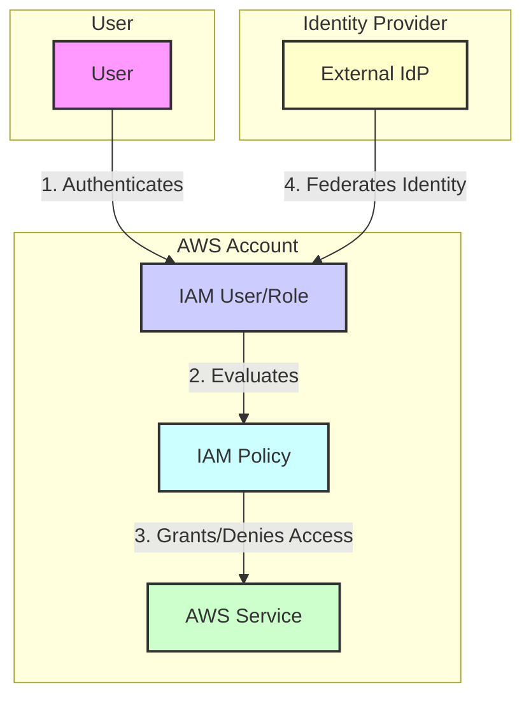

This diagram illustrates the core concepts of secure access patterns with IAM. A user authenticates with an IAM user or role, which then evaluates an IAM policy to determine whether to grant or deny access to an AWS service. The diagram also shows how an external identity provider can be used to federate identity and provide access to AWS resources.

### 2.2. Task Statement 1.2: Design Secure Workloads and Applications

The second task statement in the "Design Secure Architectures" domain is to "Design Secure Workloads and Applications." This task statement focuses on the principles and practices of securing the applications and workloads that are running on AWS. It covers a wide range of topics, from securing the network infrastructure to protecting the application layer from common web exploits. The goal of this task statement is to ensure that candidates can design and implement a defense-in-depth strategy that protects their applications and workloads from a variety of threats. This includes understanding how to use VPC security groups and network ACLs to control network traffic, how to use AWS WAF and Shield to protect against web-based attacks, and how to use AWS Secrets Manager to manage sensitive information like database passwords and API keys. The exam questions in this area are often scenario-based, requiring candidates to design a secure architecture for a specific application or workload. This may involve configuring VPC security, setting up a web application firewall, or implementing a secrets management solution.

#### 2.2.1. VPC Security: Subnets, Security Groups, and NACLs

Amazon Virtual Private Cloud (VPC) is a fundamental service for creating a secure and isolated network environment on AWS. It allows you to launch AWS resources into a virtual network that you have defined. A VPC is a logically isolated section of the AWS cloud, and it gives you complete control over your virtual networking environment. The core components of a VPC include subnets, security groups, and network ACLs. **Subnets** are segments of a VPC's IP address range where you can place groups of isolated resources. You can create public subnets for resources that need to be accessible from the internet, and private subnets for resources that should not be accessible from the internet. **Security groups** are virtual firewalls that control inbound and outbound traffic for your instances. You can create security group rules that allow or deny traffic based on the source or destination IP address, port, and protocol. **Network ACLs** are another layer of security that act as a firewall for controlling traffic in and out of one or more subnets. They are stateless, which means that you need to create separate rules for inbound and outbound traffic. A deep understanding of these components is essential for designing a secure VPC architecture.

#### 2.2.2. Application Layer Security with AWS WAF and Shield

AWS WAF (Web Application Firewall) is a web application firewall that helps protect your web applications from common web exploits that could affect application availability, compromise security, or consume excessive resources. WAF allows you to create custom rules to block, allow, or monitor web requests based on conditions that you define. These conditions can include IP addresses, HTTP headers, HTTP body, or URI strings. AWS Shield is a managed Distributed Denial of Service (DDoS) protection service that safeguards your applications running on AWS. Shield provides always-on detection and automatic inline mitigations that minimize application downtime and latency. There are two tiers of Shield: **Standard** and **Advanced**. Shield Standard is available to all AWS customers at no additional cost and provides protection against common, most frequently occurring network and transport layer DDoS attacks. Shield Advanced provides additional protection against larger and more sophisticated DDoS attacks, as well as 24/7 access to the AWS DDoS Response Team (DRT). The use of WAF and Shield is a critical component of a defense-in-depth security strategy for your web applications.

#### 2.2.3. Secrets Management with AWS Secrets Manager

AWS Secrets Manager is a service that helps you protect access to your applications, services, and IT resources without the upfront investment and on-going maintenance costs of operating your own infrastructure. Secrets Manager enables you to easily rotate, manage, and retrieve database credentials, API keys, and other secrets throughout their lifecycle. You can use Secrets Manager to store and manage secrets, and then retrieve them programmatically from your applications. This eliminates the need to hardcode secrets in your application code, which is a major security risk. Secrets Manager also provides built-in integration with other AWS services, such as RDS, to automate the rotation of database credentials. The use of Secrets Manager is a best practice for managing secrets in a secure and scalable way, and it is a key component of a secure application architecture.

#### 2.2.4. Diagram: A Secure Multi-Tier VPC Architecture

```mermaid
graph TD
    subgraph "Internet"
        A[Users];
    end
    subgraph "VPC"
        subgraph "Public Subnet"
            B[Application Load Balancer];
            C[NAT Gateway];
        end
        subgraph "Private Subnet (App Tier)"
            D[EC2 Instances];
        end
        subgraph "Private Subnet (Data Tier)"
            E[RDS Database];
        end
    end
    subgraph "Security Controls"
        F[Security Groups];
        G[NACLs];
        H[WAF];
    end
    A -->|HTTPS| H;
    H -->|HTTPS| B;
    B -->|HTTP| D;
    D -->|SQL| E;
    C -->|Outbound| A;
    F --> D;
    F --> E;
    G --> Public Subnet;
    G --> Private Subnet;
```

This diagram illustrates a secure multi-tier VPC architecture. The architecture uses a public subnet for the Application Load Balancer and a NAT Gateway, and private subnets for the application tier (EC2 instances) and the data tier (RDS database). The Application Load Balancer is protected by AWS WAF, which filters out malicious traffic. Security groups are used to control traffic between the tiers, and NACLs provide an additional layer of security at the subnet level. This architecture follows the principle of defense-in-depth, with multiple layers of security to protect the application and its data.

### 2.3. Task Statement 1.3: Determine Appropriate Data Security Controls

The third task statement in the "Design Secure Architectures" domain is to "Determine Appropriate Data Security Controls." This task statement focuses on the principles and practices of protecting data at rest and in transit. It covers a wide range of topics, from data classification and governance to encryption and key management. The goal of this task statement is to ensure that candidates can design and implement a comprehensive data security strategy that protects sensitive information from unauthorized access. This includes understanding how to use encryption to protect data at rest and in transit, how to use AWS Key Management Service (KMS) to manage encryption keys, and how to use data governance policies to control access to data. The exam questions in this area are often scenario-based, requiring candidates to design a data security solution that meets specific compliance requirements. This may involve configuring encryption for a database, setting up a key management solution, or implementing data access policies.

#### 2.3.1. Encryption at Rest and In Transit

Data encryption is a critical component of data security, and it is a key topic on the SAA-C03 exam. **Encryption at rest** is the process of encrypting data when it is stored on a disk or other storage medium. Encryption in transit is the process of encrypting data when it is being transmitted over a network. AWS provides a variety of services and features that you can use to encrypt your data at rest and in transit. For example, you can use AWS Key Management Service (KMS) to create and manage the encryption keys that are used to encrypt your data. You can also use AWS Certificate Manager (ACM) to provision, manage, and deploy SSL/TLS certificates for use with AWS services, which can help to secure data in transit.

#### 2.3.2. AWS Key Management Service (KMS) and AWS Certificate Manager (ACM)

AWS Key Management Service (KMS) is a managed service that makes it easy for you to create and control the encryption keys used to encrypt your data. It is a highly available and durable service that is designed to meet the security and compliance requirements of your organization. AWS Certificate Manager (ACM) is a service that lets you easily provision, manage, and deploy SSL/TLS certificates for use with AWS services. It removes the time-consuming manual process of purchasing, uploading, and renewing SSL/TLS certificates. The SAA-C03 exam will test your knowledge of both KMS and ACM, and your ability to use them to implement a comprehensive data encryption strategy.

#### 2.3.3. Data Governance and Access Policies for S3

Amazon S3 is a highly durable and scalable object storage service that is used to store and retrieve any amount of data from anywhere on the web. Data governance and access control are critical aspects of securing your data in S3. You can use S3 bucket policies and IAM policies to control access to your S3 buckets and objects. You can also use S3 Access Points to create unique hostnames for your S3 buckets, which can simplify the process of managing access to your data. The SAA-C03 exam will test your knowledge of S3 security features and your ability to use them to implement a secure and well-architected data storage solution.

#### 2.3.4. Diagram: End-to-End Data Encryption Strategy

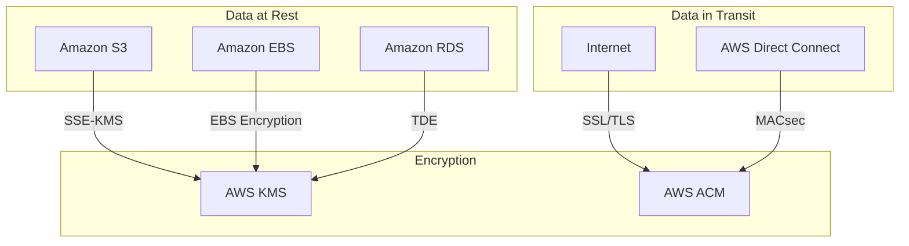

This diagram illustrates an end-to-end data encryption strategy. The diagram shows how you can use AWS KMS to encrypt data at rest in Amazon S3, Amazon EBS, and Amazon RDS. The diagram also shows how you can use AWS ACM to encrypt data in transit over the internet and AWS Direct Connect.

## 3. Domain 2: Design Resilient Architectures (26%)

Domain 2 of the SAA-C03 exam focuses on designing resilient architectures, which are systems that can withstand failures and recover quickly. This domain accounts for **26%** of the total exam score, making it the second most important domain to master. The key task statements in this domain are: designing scalable and loosely coupled architectures, designing highly available and/or fault-tolerant architectures, and designing for disaster recovery (DR). Each of these task statements requires a combination of theoretical knowledge and practical skills, which are detailed in the official AWS exam guide .

### 3.1. Task Statement 2.1: Design Scalable and Loosely Coupled Architectures

This task statement focuses on designing architectures that can scale to meet changing demands and are loosely coupled to minimize the impact of failures. It requires a deep understanding of auto scaling, load balancing, and decoupling services. The goal is to create a system that can handle increased traffic without performance degradation and can continue to operate even if one or more components fail. The official exam guide outlines the specific knowledge and skills required for this task, which include understanding API creation and management, AWS managed services, caching strategies, and design principles for microservices .

#### 3.1.1. Auto Scaling Groups and Launch Templates

Auto Scaling Groups (ASGs) are a key component of designing scalable architectures on AWS. They allow you to automatically scale the number of EC2 instances in your application based on demand. You can define scaling policies that specify when to add or remove instances, such as when CPU utilization exceeds a certain threshold. Launch templates are used to define the configuration for the instances that are launched by an ASG, such as the AMI, instance type, and security groups. A deep understanding of ASGs and launch templates is essential for designing scalable architectures, and it is a topic that is heavily tested on the SAA-C03 exam .

#### 3.1.2. Load Balancing: ALB, NLB, and GLB Use Cases

Load balancers are another key component of designing scalable and highly available architectures. They distribute incoming traffic across multiple targets, such as EC2 instances, to improve the performance and availability of your application. AWS offers three types of load balancers: Application Load Balancer (ALB), Network Load Balancer (NLB), and Gateway Load Balancer (GLB). ALBs are used for routing HTTP/HTTPS traffic and are ideal for microservices and container-based architectures. NLBs are used for routing TCP/UDP traffic and are ideal for high-performance applications that require low latency. GLBs are used for deploying, scaling, and managing third-party virtual appliances. The SAA-C03 exam will test your knowledge of the different types of load balancers and your ability to select the appropriate one for a given use case .

#### 3.1.3. Decoupling with SQS, SNS, and EventBridge

Decoupling is a design principle that involves breaking down a monolithic application into smaller, independent components that can communicate with each other asynchronously. This can improve the scalability, resilience, and maintainability of your application. AWS offers several services that can be used to decouple your application, such as Amazon Simple Queue Service (SQS), Amazon Simple Notification Service (SNS), and Amazon EventBridge. SQS is a message queuing service that allows you to decouple the components of your application by sending messages between them. SNS is a pub/sub messaging service that allows you to send messages to multiple subscribers. EventBridge is a serverless event bus that makes it easy to connect your applications with data from a variety of sources. The SAA-C03 exam will test your knowledge of these services and your ability to design a decoupled architecture .

#### 3.1.4. Diagram: A Scalable and Decoupled Microservices Architecture

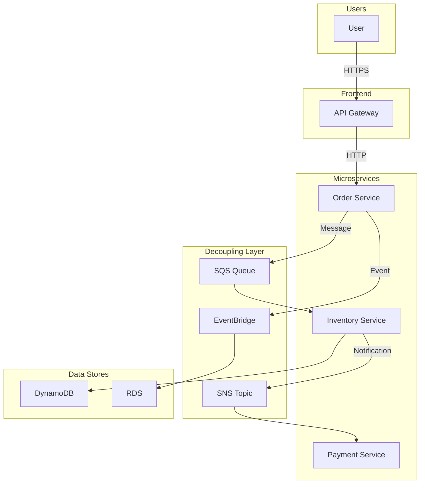

This diagram illustrates a scalable and decoupled microservices architecture. The API Gateway routes requests to the appropriate microservice. The Order Service sends a message to an SQS queue, which is then processed by the Inventory Service. The Inventory Service sends a notification to an SNS topic, which triggers the Payment Service. The Order Service also sends an event to EventBridge, which updates a database. This decoupled architecture allows each service to scale independently and improves the overall resilience of the system.

### 3.2. Task Statement 2.2: Design Highly Available and/or Fault-Tolerant Architectures

This task statement focuses on designing architectures that are highly available and fault-tolerant. It requires a deep understanding of the AWS global infrastructure, multi-AZ and multi-region deployments, and disaster recovery strategies. The goal is to create a system that can continue to operate even in the event of a failure of an entire Availability Zone or Region. The official exam guide outlines the specific knowledge and skills required for this task, which include understanding the AWS global infrastructure, disaster recovery strategies, and failover strategies .

#### 3.2.1. Multi-AZ and Multi-Region Deployments

Multi-AZ and multi-region deployments are two key strategies for designing highly available and fault-tolerant architectures. A **multi-AZ deployment** involves deploying your application across multiple Availability Zones (AZs) within a single Region. This can protect your application from a failure of a single AZ. A **multi-region deployment** involves deploying your application across multiple Regions. This can protect your application from a failure of an entire Region. The SAA-C03 exam will test your knowledge of multi-AZ and multi-region deployments and your ability to design a highly available and fault-tolerant architecture .

#### 3.2.2. Understanding AWS Global Infrastructure (Regions, AZs, Edge Locations)

A deep understanding of the AWS global infrastructure is essential for designing highly available and fault-tolerant architectures. The AWS global infrastructure is composed of **Regions**, **Availability Zones (AZs)** , and **Edge Locations**. A Region is a physical location in the world where AWS has multiple AZs. An AZ is one or more discrete data centers with redundant power, networking, and connectivity in a Region. An Edge Location is a site that AWS uses to cache content for delivery to end users. The SAA-C03 exam will test your knowledge of the AWS global infrastructure and your ability to leverage it to design a highly available and fault-tolerant architecture .

#### 3.2.3. High Availability for Databases (RDS Multi-AZ, Aurora)

High availability for databases is a critical aspect of designing resilient architectures. AWS offers several options for making your databases highly available, such as **Amazon RDS Multi-AZ** and **Amazon Aurora**. Amazon RDS Multi-AZ provides a high availability deployment option for your database by automatically creating a primary database instance and a synchronous standby replica in a different AZ. Amazon Aurora is a MySQL and PostgreSQL-compatible relational database that is designed for the cloud. It provides high availability and durability by replicating your data across multiple AZs. The SAA-C03 exam will test your knowledge of these options and your ability to design a highly available database architecture .

#### 3.2.4. Diagram: A Fault-Tolerant Architecture Across Multiple AZs

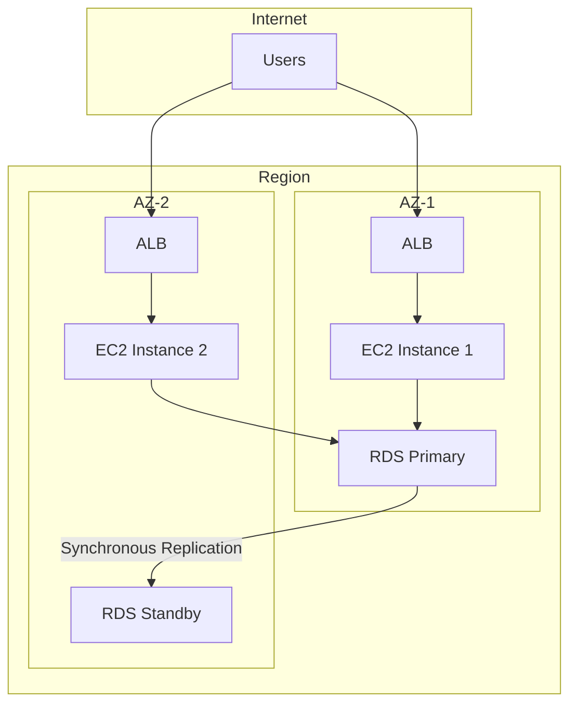

This diagram illustrates a fault-tolerant architecture deployed across multiple Availability Zones (AZs). The Application Load Balancer (ALB) distributes traffic to EC2 instances in both AZ-1 and AZ-2. The RDS database is configured in Multi-AZ mode, with a primary instance in AZ-1 and a synchronous standby replica in AZ-2. If AZ-1 fails, the ALB will route traffic to the EC2 instance in AZ-2, and RDS will automatically failover to the standby replica in AZ-2, ensuring high availability.

### 3.3. Task Statement 2.3: Design for Disaster Recovery (DR)

This task statement focuses on designing for disaster recovery (DR), which is the process of preparing for and recovering from a disaster that causes a significant disruption to your business. It requires a deep understanding of the different DR strategies, data replication techniques, and failover mechanisms. The goal is to create a plan that can restore your systems and data in a timely manner, minimizing the impact on your business. The official exam guide outlines the specific knowledge and skills required for this task, which include understanding disaster recovery strategies, data replication, and failover strategies .

#### 3.3.1. DR Strategies: Backup & Restore, Pilot Light, Warm Standby, Multi-Site

There are four main DR strategies that you should be familiar with for the SAA-C03 exam:

1.  **Backup & Restore**: This is the simplest and most cost-effective DR strategy. It involves regularly backing up your data to a separate location and then restoring it in the event of a disaster. This strategy has the longest recovery time.
2.  **Pilot Light**: This strategy involves keeping a minimal version of your environment running in a separate Region. This "pilot light" can be quickly scaled up to a full production environment in the event of a disaster.
3.  **Warm Standby**: This strategy involves maintaining a scaled-down but fully functional version of your environment in a separate Region. This "warm standby" can be quickly scaled up to handle the full production load in the event of a disaster.
4.  **Multi-Site**: This is the most expensive and complex DR strategy, but it also has the shortest recovery time. It involves running a fully redundant copy of your environment in a separate Region, with traffic being actively routed to both sites.

The SAA-C03 exam will test your knowledge of these strategies and your ability to select the appropriate one for a given scenario.

#### 3.3.2. Data Replication and Recovery with AWS Services

Data replication is a critical component of any DR strategy. It involves copying your data to a separate location so that it can be recovered in the event of a disaster. AWS offers several services that can be used for data replication, such as Amazon S3 Cross-Region Replication (CRR), Amazon RDS automated backups, and AWS Backup. The SAA-C03 exam will test your knowledge of these services and your ability to design a data replication strategy that meets your RPO (Recovery Point Objective) and RTO (Recovery Time Objective) requirements.

#### 3.3.3. Using Route 53 for DNS Failover

Amazon Route 53 is a highly available and scalable Domain Name System (DNS) web service. It can be used to implement DNS failover, which is a technique for routing traffic to a healthy endpoint in the event of a failure. For example, you can configure Route 53 to monitor the health of your primary site and automatically route traffic to your DR site if the primary site becomes unavailable. The SAA-C03 exam will test your knowledge of Route 53 and your ability to use it to implement a DNS failover solution.

#### 3.3.4. Diagram: Comparing DR Strategies on AWS

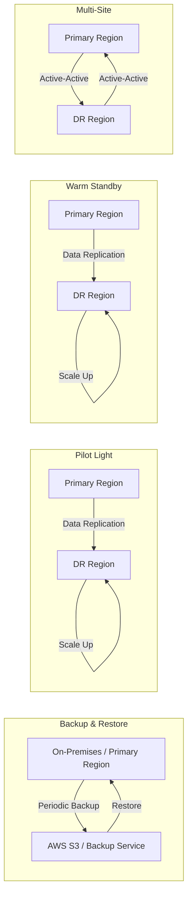

This diagram compares the four main DR strategies on AWS. The Backup & Restore strategy involves backing up data to a separate location and restoring it when needed. The Pilot Light strategy involves keeping a minimal environment running in a DR Region. The Warm Standby strategy involves maintaining a scaled-down but functional environment in a DR Region. The Multi-Site strategy involves running a fully redundant copy of the environment in a DR Region.

## 4. Domain 3: Design High-Performing Architectures (24%)

Domain 3 of the SAA-C03 exam focuses on designing high-performing architectures, which are systems that are optimized for speed and efficiency. This domain accounts for **24%** of the total exam score, making it the third most important domain to master. The key task statements in this domain are: determining high-performing and/or scalable storage solutions, designing high-performing and elastic compute solutions, determining high-performing database solutions, and determining high-performing data ingestion and transformation solutions. Each of these task statements requires a combination of theoretical knowledge and practical skills, which are detailed in the official AWS exam guide .

### 4.1. Task Statement 3.1: Determine High-Performing and/or Scalable Storage Solutions

This task statement focuses on selecting the right storage services and configurations to meet the performance demands of your application. It requires a deep understanding of the different types of storage services offered by AWS, such as Amazon S3, Amazon EBS, and Amazon EFS, and their respective performance characteristics. The goal is to choose a storage solution that can provide the required level of performance, scalability, and durability for your application. The official exam guide outlines the specific knowledge and skills required for this task, which include understanding hybrid storage solutions, storage services with appropriate use cases, and storage types with associated characteristics .

#### 4.1.1. Amazon S3 Storage Classes and Performance

Amazon S3 is a highly scalable, durable, and secure object storage service. It offers a range of storage classes that are designed for different use cases and performance requirements. The S3 storage classes include **S3 Standard**, **S3 Intelligent-Tiering**, **S3 Standard-IA (Infrequent Access)** , **S3 One Zone-IA**, **S3 Glacier**, and **S3 Glacier Deep Archive**. S3 Standard is designed for frequently accessed data and provides high durability and availability. S3 Intelligent-Tiering is designed for data with unknown or changing access patterns and automatically moves data to the most cost-effective storage tier. S3 Standard-IA and S3 One Zone-IA are designed for infrequently accessed data and provide a lower storage cost than S3 Standard. S3 Glacier and S3 Glacier Deep Archive are designed for long-term archival and provide the lowest storage cost. The SAA-C03 exam will test your knowledge of the different S3 storage classes and your ability to select the appropriate one for a given use case .

#### 4.1.2. EBS Volume Types and Use Cases

Amazon Elastic Block Store (EBS) is a high-performance block storage service designed for use with Amazon EC2. It offers a range of volume types that are designed for different use cases and performance requirements. The EBS volume types include **General Purpose SSD (gp3 and gp2)** , **Provisioned IOPS SSD (io2 and io1)** , **Throughput Optimized HDD (st1)** , and **Cold HDD (sc1)** . General Purpose SSD volumes are a good choice for a wide variety of workloads, including boot volumes, development and test environments, and low-latency interactive applications. Provisioned IOPS SSD volumes are designed for I/O-intensive workloads, such as large relational or NoSQL databases. Throughput Optimized HDD volumes are a good choice for frequently accessed, throughput-intensive workloads, such as big data, data warehouses, and log processing. Cold HDD volumes are a good choice for less frequently accessed workloads, such as archival data. The SAA-C03 exam will test your knowledge of the different EBS volume types and your ability to select the appropriate one for a given use case.

#### 4.1.3. EFS and FSx for Shared File Storage

Amazon Elastic File System (EFS) is a fully managed NFS file system that can be mounted on multiple EC2 instances at the same time. It is a good choice for workloads that require shared file storage, such as content management systems, web serving, and data science applications. Amazon FSx is a fully managed service that makes it easy to launch and run popular file systems, such as Lustre and Windows File Server. FSx for Lustre is a good choice for high-performance computing (HPC) workloads, while FSx for Windows File Server is a good choice for Windows-based applications. The SAA-C03 exam will test your knowledge of EFS and FSx and your ability to select the appropriate one for a given use case.

#### 4.1.4. Diagram: Selecting the Right Storage Service

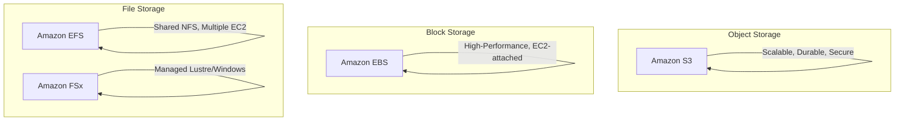

This diagram illustrates the different types of storage services available on AWS and their key characteristics. Amazon S3 is an object storage service that is scalable, durable, and secure. Amazon EBS is a block storage service that is high-performance and can be attached to EC2 instances. Amazon EFS is a file storage service that uses the NFS protocol and can be mounted on multiple EC2 instances. Amazon FSx is a managed file storage service that supports Lustre and Windows File Server.

### 4.2. Task Statement 3.2: Determine High-Performing and/or Scalable Compute Solutions

This task statement focuses on selecting the right compute services and configurations to meet the performance demands of your application. It requires a deep understanding of the different types of compute services offered by AWS, such as Amazon EC2, AWS Lambda, and Amazon ECS, and their respective performance characteristics. The goal is to choose a compute solution that can provide the required level of performance, scalability, and cost-effectiveness for your application. The official exam guide outlines the specific knowledge and skills required for this task, which include understanding elastic and scalable compute solutions for a workload, serverless and container technologies, and edge computing capabilities .

#### 4.2.1. EC2 Instance Families and Sizing

Amazon EC2 offers a wide range of instance types that are designed for different use cases and performance requirements. The instance types are grouped into families based on their characteristics, such as **General Purpose (M-series)** , **Compute Optimized (C-series)** , **Memory Optimized (R-series)** , **Accelerated Computing (P-series, G-series, and F-series)** , and **Storage Optimized (I-series and D-series)** . It is important to select the right instance family and size for your workload to ensure that you have the right balance of compute, memory, and storage resources. The SAA-C03 exam will test your knowledge of the different EC2 instance families and your ability to select the appropriate one for a given use case.

#### 4.2.2. Serverless Compute with AWS Lambda

AWS Lambda is a serverless compute service that allows you to run code without provisioning or managing servers. You only pay for the compute time that you consume, and Lambda automatically scales your application in response to incoming requests. Lambda is a good choice for event-driven workloads, such as data processing, real-time file processing, and IoT backends. The SAA-C03 exam will test your knowledge of Lambda and your ability to design a serverless architecture.

#### 4.2.3. Container Services: ECS and EKS

Amazon Elastic Container Service (ECS) and Amazon Elastic Kubernetes Service (EKS) are container orchestration services that allow you to run and manage Docker containers at scale. ECS is a fully managed service that is deeply integrated with other AWS services, while EKS is a managed Kubernetes service that gives you the flexibility to use the open-source Kubernetes platform. Both services are a good choice for microservices architectures and applications that are already containerized. The SAA-C03 exam will test your knowledge of ECS and EKS and your ability to design a containerized architecture.

#### 4.2.4. Diagram: Comparing Compute Options for Different Workloads

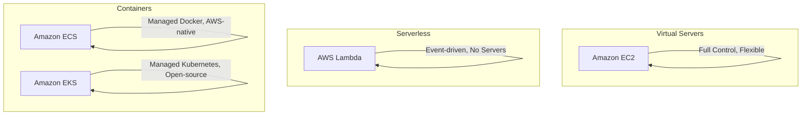

This diagram compares the different compute options available on AWS. Amazon EC2 provides full control and flexibility with virtual servers. AWS Lambda is a serverless option that is ideal for event-driven workloads. Amazon ECS is a managed Docker service that is deeply integrated with AWS. Amazon EKS is a managed Kubernetes service that provides the flexibility of the open-source Kubernetes platform.

### 4.3. Task Statement 3.3: Determine High-Performing Database Solutions

This task statement focuses on selecting the right database services and configurations to meet the performance demands of your application. It requires a deep understanding of the different types of database services offered by AWS, such as Amazon RDS, Amazon DynamoDB, and Amazon ElastiCache, and their respective performance characteristics. The goal is to choose a database solution that can provide the required level of performance, scalability, and availability for your application. The official exam guide outlines the specific knowledge and skills required for this task, which include understanding purpose-built databases for a workload, caching to improve performance, and database connection management .

#### 4.3.1. Relational Databases: RDS and Aurora

Amazon Relational Database Service (RDS) is a fully managed service that makes it easy to set up, operate, and scale a relational database in the cloud. It supports several popular database engines, including MySQL, PostgreSQL, MariaDB, Oracle, and SQL Server. Amazon Aurora is a MySQL and PostgreSQL-compatible relational database that is designed for the cloud. It provides high performance and availability, and it is a good choice for applications that require a relational database with the performance of a commercial database at a lower cost. The SAA-C03 exam will test your knowledge of RDS and Aurora and your ability to select the appropriate one for a given use case.

#### 4.3.2. NoSQL Databases: DynamoDB

Amazon DynamoDB is a fully managed NoSQL database service that provides fast and predictable performance with seamless scalability. It is a good choice for applications that require a flexible data model and high throughput, such as gaming, IoT, and mobile applications. DynamoDB supports both document and key-value data models, and it can handle millions of requests per second. The SAA-C03 exam will test your knowledge of DynamoDB and your ability to design a NoSQL database solution.

#### 4.3.3. Caching Strategies with ElastiCache

Amazon ElastiCache is a fully managed in-memory data store and cache service. It supports two popular open-source in-memory engines: **Redis** and **Memcached**. ElastiCache can be used to improve the performance of your application by caching frequently accessed data in memory, which can reduce the load on your database and improve response times. The SAA-C03 exam will test your knowledge of ElastiCache and your ability to design a caching strategy.

#### 4.3.4. Diagram: Choosing Between SQL and NoSQL on AWS

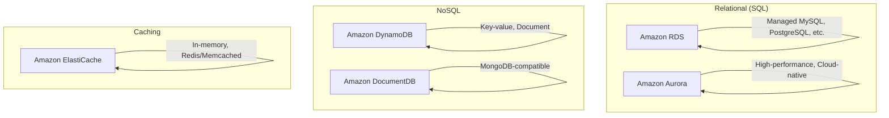

This diagram illustrates the different database options available on AWS. Amazon RDS and Aurora are relational (SQL) databases, while DynamoDB and DocumentDB are NoSQL databases. Amazon ElastiCache is an in-memory caching service that can be used to improve the performance of your database.

### 4.4. Task Statement 3.4: Determine High-Performing Data Ingestion and Transformation Solutions

This task statement focuses on selecting the right data ingestion and transformation services to meet the performance demands of your application. It requires a deep understanding of the different types of data ingestion and transformation services offered by AWS, such as Amazon Kinesis, AWS Glue, and Amazon Redshift, and their respective performance characteristics. The goal is to choose a solution that can provide the required level of performance, scalability, and cost-effectiveness for your data processing needs. The official exam guide outlines the specific knowledge and skills required for this task, which include understanding data ingestion and transformation solutions .

#### 4.4.1. Data Streaming with Kinesis and MSK

Amazon Kinesis is a platform for streaming data on AWS. It offers several services, including **Kinesis Data Streams**, **Kinesis Data Firehose**, and **Kinesis Data Analytics**. Kinesis Data Streams is a service for building custom applications that process or analyze streaming data. Kinesis Data Firehose is a service for loading streaming data into data lakes, data stores, and analytics services. Kinesis Data Analytics is a service for processing and analyzing streaming data using SQL or Apache Flink. Amazon Managed Streaming for Apache Kafka (MSK) is a fully managed service that makes it easy to build and run applications that use Apache Kafka to process streaming data. The SAA-C03 exam will test your knowledge of Kinesis and MSK and your ability to design a data streaming solution.

#### 4.4.2. ETL with AWS Glue

AWS Glue is a fully managed extract, transform, and load (ETL) service that makes it easy to prepare and load your data for analytics. It provides a visual interface for creating and running ETL jobs, and it can automatically generate the code for your ETL jobs. AWS Glue is a good choice for data integration, data cleansing, and data transformation. The SAA-C03 exam will test your knowledge of AWS Glue and your ability to design an ETL solution.

#### 4.4.3. Data Warehousing with Redshift

Amazon Redshift is a fast, scalable, and fully managed data warehouse service. It is a good choice for analyzing large amounts of data using SQL and your existing business intelligence tools. Redshift is designed for high-performance analytics, and it can handle petabyte-scale data warehouses. The SAA-C03 exam will test your knowledge of Redshift and your ability to design a data warehousing solution.

#### 4.4.4. Diagram: A High-Performance Data Analytics Pipeline

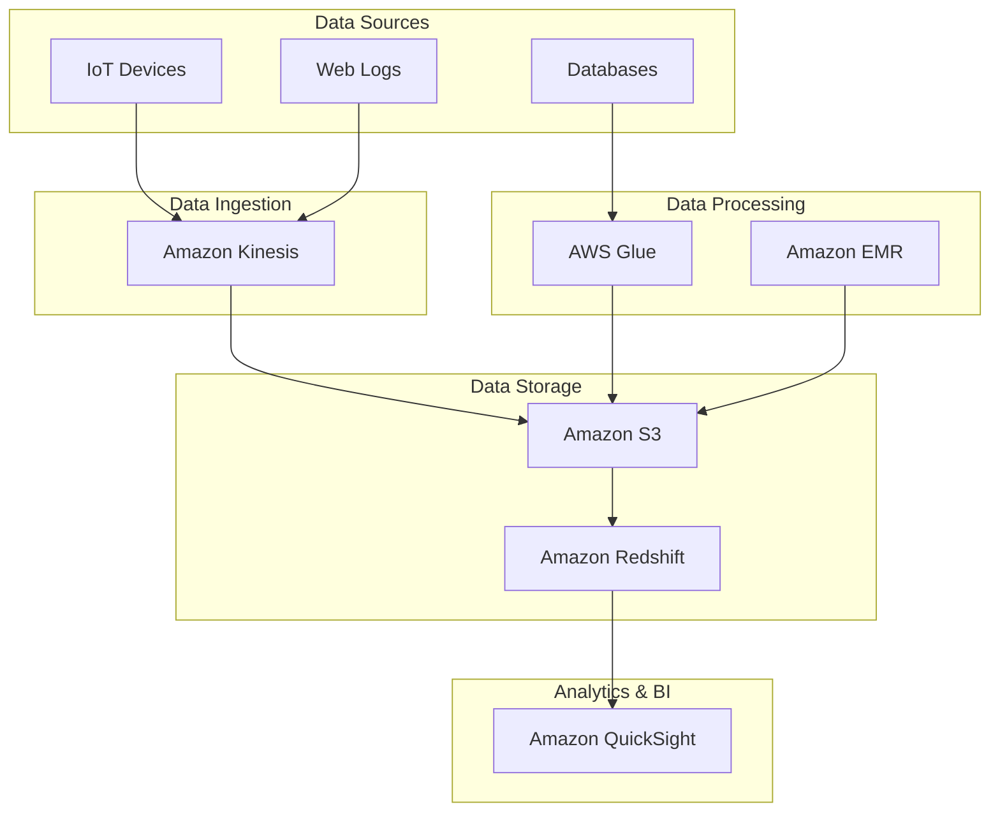

This diagram illustrates a high-performance data analytics pipeline. Data from various sources is ingested using Amazon Kinesis and AWS Glue. The data is then stored in Amazon S3 and processed using Amazon EMR. The processed data is then loaded into Amazon Redshift for analytics and visualization using Amazon QuickSight.

## 5. Domain 4: Design Cost-Optimized Architectures (20%)

The fourth and final domain of the AWS Certified Solutions Architect - Associate (SAA-C03) exam, "Design Cost-Optimized Architectures," carries a significant weight of **20%** . This domain is critical for any aspiring solutions architect, as it directly addresses one of the primary business drivers for adopting cloud computing: cost efficiency. The ability to design solutions that are not only secure, resilient, and high-performing but also cost-effective is a hallmark of a skilled AWS professional. This section of the exam guide delves into the principles and practices of creating architectures that minimize unnecessary expenditure without compromising on required performance or availability. It covers a wide range of services and strategies, from selecting the right storage class for your data to choosing the most economical compute and database options. A deep understanding of this domain is essential for passing the exam and for real-world application, where cost optimization is a continuous process of refinement and improvement. The exam questions in this domain will test your ability to analyze a given scenario, identify areas of potential cost savings, and recommend the most appropriate AWS services and features to achieve those savings.

### 5.1. Task Statement 4.1: Design Cost-Optimized Storage Solutions

This task statement focuses on the principles and practices of designing storage solutions that are both effective and economical. It requires a deep understanding of the various AWS storage services, their pricing models, and the features that can be leveraged to control and reduce costs. The core of this task is to move beyond simply storing data and to think strategically about how data is accessed, how long it needs to be retained, and how it can be moved to lower-cost tiers over its lifecycle. This involves a comprehensive knowledge of the different storage types available on AWS, such as object, file, and block storage, and the ability to select the most appropriate service for a given workload. For example, understanding the access patterns of your data is crucial; frequently accessed data should be stored in a high-performance, more expensive tier, while infrequently accessed or archival data should be moved to a lower-cost, cold storage tier. The exam will test your ability to apply these concepts to real-world scenarios, requiring you to design storage strategies that balance performance, durability, and cost.

#### 5.1.1. S3 Lifecycle Policies and Intelligent-Tiering

A fundamental aspect of designing cost-optimized storage solutions is a thorough understanding of storage access patterns and the concept of storage tiering. The exam guide explicitly mentions the need for knowledge of "Storage access patterns" and "Storage tiering (for example, cold tiering for object storage)" . This means you must be able to analyze how data is used within an application and classify it based on its access frequency. For instance, data that is actively used by an application is considered "hot" and requires high-performance storage like Amazon S3 Standard. Data that is accessed less frequently but still needs to be readily available is "warm" and can be moved to a lower-cost tier like S3 Standard-IA (Infrequent Access) or S3 One Zone-IA. Finally, data that is rarely accessed and is primarily for long-term archival purposes is "cold" and should be stored in the most cost-effective tiers like S3 Glacier or S3 Glacier Deep Archive. Understanding these patterns allows you to implement lifecycle policies that automatically transition data between these tiers, ensuring that you are not paying premium prices for data that is not actively being used. This knowledge is critical for answering questions that present a scenario with specific data access requirements and ask you to select the most cost-effective storage solution.

#### 5.1.2. EBS Snapshots and Archive Storage

Beyond just understanding the theory, the exam requires you to demonstrate practical skills in managing storage costs. The guide highlights the importance of "Managing S3 object lifecycles" and "Selecting the appropriate storage tier" as key skills . This means you should be able to design and implement S3 Lifecycle policies that define a set of rules for transitioning objects between different storage classes or for expiring them after a certain period. For example, you might create a policy that moves objects from S3 Standard to S3 Standard-IA after 30 days, and then to S3 Glacier after 90 days. This automated approach to data management is a powerful tool for cost optimization, as it ensures that data is always stored in the most cost-effective tier based on its age and access patterns. Furthermore, you need to be able to select the most appropriate storage service for a given workload, taking into account factors such as performance, durability, availability, and cost. This includes not only the various S3 storage classes but also other services like Amazon EBS for block storage and Amazon EFS for file storage. The ability to compare and contrast these services and choose the right one for the job is a key skill that will be tested on the exam.

#### 5.1.3. Data Transfer Costs and Optimization

Data transfer costs can be a significant component of your overall AWS bill, and the exam guide specifically mentions the need for skills in "Determining the lowest cost method of transferring data for a workload to AWS storage" . This requires a comprehensive understanding of the various data transfer services available on AWS and their associated costs. For example, when migrating large amounts of data to AWS, you need to be able to evaluate the trade-offs between using services like AWS Direct Connect, which provides a dedicated network connection, and AWS Snowball, a physical device that is shipped to your location for data transfer. The choice between these services will depend on factors such as the amount of data, the available network bandwidth, and the required speed of the migration. Similarly, for ongoing data transfer, you need to be aware of the costs associated with transferring data between different AWS services and from AWS to the internet. Understanding how to use services like Amazon CloudFront to cache content at edge locations and reduce data transfer costs is also a key aspect of this skill. The exam will likely present scenarios where you need to choose the most cost-effective data transfer solution, so a solid understanding of the pricing models for these services is essential.

#### 5.1.4. Diagram: Cost Optimization for Data Storage

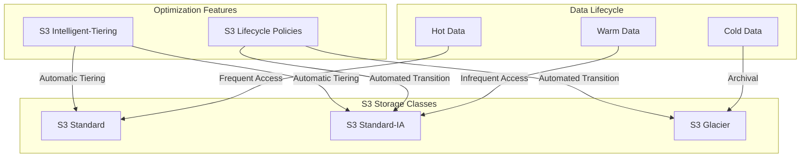

This diagram illustrates cost optimization for data storage using Amazon S3. Hot data is stored in S3 Standard, warm data is moved to S3 Standard-IA, and cold data is archived in S3 Glacier. S3 Lifecycle Policies can be used to automate the transition of data between these storage classes. S3 Intelligent-Tiering can be used to automatically move data to the most cost-effective tier based on its access patterns.

### 5.2. Task Statement 4.2: Design Cost-Optimized Compute Solutions

This task statement is centered on the principles of designing compute solutions that are both powerful and economical. It requires a deep understanding of the various AWS compute services, their pricing models, and the strategies that can be employed to optimize their utilization and minimize costs. The core of this task is to move beyond simply provisioning compute resources and to think strategically about how those resources are used, how they are scaled, and how they are purchased. This involves a comprehensive knowledge of the different instance types and families available on Amazon EC2, as well as the various purchasing options like On-Demand, Reserved Instances, and Spot Instances. The exam will test your ability to apply these concepts to real-world scenarios, requiring you to design compute architectures that balance performance, availability, and cost. For example, you might be asked to design a solution for a batch processing workload that can take advantage of the low cost of Spot Instances, or to recommend a serverless architecture using AWS Lambda to eliminate the need for provisioning and managing servers altogether.

#### 5.2.1. EC2 Pricing Models: On-Demand, Reserved, Spot, and Savings Plans

A critical component of designing cost-optimized compute solutions is a thorough understanding of the various AWS purchasing options and the different types of EC2 instances available. The exam guide explicitly mentions the need for knowledge of "AWS purchasing options (for example, Spot Instances, Reserved Instances, Savings Plans)" and "Instance types, families, and sizes (for example, memory optimized, compute optimized, virtualization)" . This means you must be able to differentiate between the different purchasing models and understand their appropriate use cases. On-Demand Instances are ideal for short-term, irregular workloads that cannot be interrupted, while Reserved Instances and Savings Plans offer significant discounts for workloads with predictable usage patterns. Spot Instances provide the deepest discounts but are best suited for fault-tolerant, flexible workloads that can be interrupted. In addition to the purchasing options, you need to have a deep understanding of the different EC2 instance families, such as compute-optimized (C-series), memory-optimized (R-series), and general-purpose (M-series), and be able to select the right instance type and size for a given workload. This knowledge is essential for right-sizing your compute resources and avoiding over-provisioning, which is a common source of unnecessary costs.

#### 5.2.2. Right-Sizing Instances with Compute Optimizer

Beyond just selecting the right instance type and purchasing option, the exam requires you to demonstrate practical skills in designing scalable and resilient compute architectures. The guide highlights the importance of "Determining appropriate scaling methods and strategies for elastic workloads (for example, horizontal compared with vertical, EC2 hibernation)" and "Determining an appropriate load balancing strategy (for example, Application Load Balancer [Layer 7] compared with Network Load Balancer [Layer 4] compared with Gateway Load Balancer)" . This means you should be able to design an Auto Scaling group that can automatically add or remove EC2 instances based on demand, ensuring that you are only paying for the compute capacity that you actually need. You should also understand the different scaling strategies, such as horizontal scaling (adding more instances) and vertical scaling (increasing the size of an instance), and be able to choose the right one for a given scenario. Furthermore, you need to be able to select the appropriate load balancer to distribute traffic across your instances, taking into account factors such as the protocol, port, and path of the traffic. The ability to design a scalable and resilient compute architecture is a key skill that will be tested on the exam.

#### 5.2.3. Using Lambda to Reduce Compute Costs

The exam guide also emphasizes the need for skills in "Determining cost-effective AWS compute services with appropriate use cases (for example, Lambda, Amazon EC2, Fargate)" . This requires a broad understanding of the various compute services available on AWS and their respective strengths and weaknesses. While EC2 provides the most flexibility and control, it also requires you to manage the underlying infrastructure, which can be time-consuming and costly. AWS Lambda, on the other hand, is a serverless compute service that allows you to run code without provisioning or managing servers, and you only pay for the compute time that you consume. This makes it an extremely cost-effective option for event-driven workloads and microservices. Amazon ECS and EKS are container orchestration services that allow you to run and manage Docker containers at scale, and they can be a cost-effective option for applications that are already containerized. The exam will likely present scenarios where you need to choose the most cost-effective compute service for a given workload, so a solid understanding of the use cases for each service is essential.

#### 5.2.4. Diagram: Strategies for Reducing Compute Costs

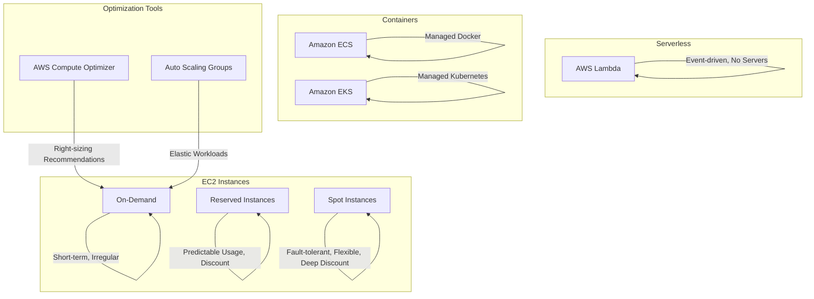

This diagram illustrates strategies for reducing compute costs on AWS. On-Demand instances are for short-term workloads, Reserved Instances offer discounts for predictable usage, and Spot Instances provide deep discounts for fault-tolerant workloads. AWS Lambda is a serverless option for event-driven workloads. Amazon ECS and EKS are container orchestration services. AWS Compute Optimizer can be used to right-size instances, and Auto Scaling Groups can be used to handle elastic workloads.

### 5.3. Task Statement 4.3: Design Cost-Optimized Database Solutions

This task statement focuses on the principles and practices of designing database solutions that are both performant and cost-effective. It requires a deep understanding of the various AWS database services, their pricing models, and the strategies that can be employed to optimize their utilization and minimize costs. The core of this task is to move beyond simply provisioning a database and to think strategically about the type of database that is best suited for a given workload, how it is configured, and how it is managed over time. This involves a comprehensive knowledge of the different database engines available on Amazon RDS, as well as the various NoSQL options like Amazon DynamoDB. The exam will test your ability to apply these concepts to real-world scenarios, requiring you to design database architectures that balance performance, availability, and cost. For example, you might be asked to design a solution for a read-heavy workload that can take advantage of read replicas to offload traffic from the primary database, or to recommend a serverless database like Amazon Aurora Serverless to automatically scale capacity based on demand.

#### 5.3.1. RDS and Aurora Pricing Models

A fundamental aspect of designing cost-optimized database solutions is a thorough understanding of the different types of databases available on AWS and the role of caching in improving performance and reducing costs. The exam guide explicitly mentions the need for knowledge of "Database types and services (for example, relational compared with non-relational, Aurora, DynamoDB)" and "Caching strategies" . This means you must be able to differentiate between relational databases like Amazon RDS and non-relational databases like Amazon DynamoDB, and understand their respective use cases. Relational databases are ideal for applications that require complex queries and transactions, while non-relational databases are better suited for applications that require high scalability and flexibility. In addition to the database type, you need to have a deep understanding of caching strategies and how they can be used to reduce the load on your database. For example, you can use Amazon ElastiCache to cache frequently accessed data in memory, which can significantly improve the performance of your application and reduce the number of read requests to your database, thereby lowering your database costs.

#### 5.3.2. DynamoDB On-Demand vs. Provisioned Capacity

Beyond just understanding the theory, the exam requires you to demonstrate practical skills in selecting the most cost-effective database services and types for a given workload. The guide highlights the importance of "Determining cost-effective AWS database services with appropriate use cases (for example, DynamoDB compared with Amazon RDS, serverless)" and "Determining cost-effective AWS database types (for example, time series format, columnar format)" . This means you should be able to analyze a given scenario and recommend the most appropriate database service based on factors such as the data model, the access patterns, and the required performance. For example, for a time-series workload, you might recommend Amazon Timestream, a purpose-built time-series database that is designed to be highly scalable and cost-effective. For a data warehousing workload, you might recommend Amazon Redshift, a columnar database that is optimized for analytical queries. The ability to select the right database service for the job is a key skill that will be tested on the exam.

#### 5.3.3. Data Retention and Archival Policies

The exam guide also emphasizes the need for skills in "Designing appropriate backup and retention policies (for example, snapshot frequency)" . This requires a comprehensive understanding of the backup and recovery options available for different AWS database services and the ability to design a backup strategy that meets the recovery point objective (RPO) and recovery time objective (RTO) of your application while minimizing costs. For example, you need to be able to determine the appropriate frequency for creating automated backups and snapshots, and how long to retain them. You also need to be aware of the costs associated with storing these backups and how to use features like cross-region backup replication to improve the durability of your backups. The exam will likely present scenarios where you need to design a backup and retention policy that balances the need for data protection with the need to control costs.

#### 5.3.4. Diagram: Cost-Effective Database Design Patterns

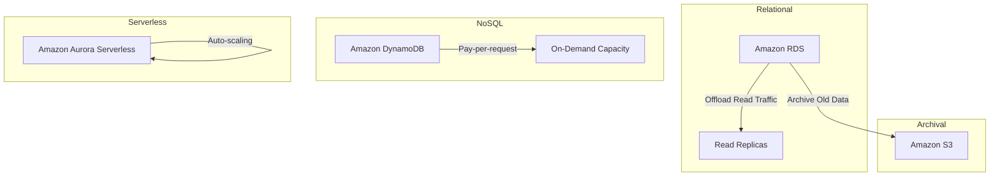

This diagram illustrates cost-effective database design patterns. Read replicas can be used to offload read traffic from a primary RDS database. DynamoDB On-Demand capacity allows you to pay per request. Aurora Serverless automatically scales capacity based on demand. Old data can be archived from RDS to Amazon S3 to reduce storage costs.

### 5.4. Task Statement 4.4: Design Cost-Optimized Network Architectures

This task statement is centered on the principles of designing network architectures that are both robust and economical. It requires a deep understanding of the various AWS networking services, their pricing models, and the strategies that can be employed to optimize data transfer and minimize costs. The core of this task is to move beyond simply creating a VPC and to think strategically about how traffic is routed, how data is transferred, and how network resources are utilized. This involves a comprehensive knowledge of the different types of load balancers, the role of Amazon CloudFront in caching content, and the use of VPC endpoints to reduce data transfer costs. The exam will test your ability to apply these concepts to real-world scenarios, requiring you to design network architectures that balance performance, security, and cost. For example, you might be asked to design a solution for a global application that uses CloudFront to cache content at edge locations, thereby reducing latency and data transfer costs for users around the world.

#### 5.4.1. VPC Endpoints to Reduce Data Transfer Costs

A fundamental aspect of designing cost-optimized network architectures is a thorough understanding of the AWS global infrastructure. The exam guide explicitly mentions the need for knowledge of "AWS global infrastructure (for example, Availability Zones, AWS Regions)" . This means you must be able to differentiate between the different components of the AWS global infrastructure and understand how they can be used to design resilient and cost-effective architectures. AWS Regions are separate geographic areas, and each Region contains multiple Availability Zones, which are isolated locations within a Region. By deploying your application across multiple Availability Zones, you can improve its availability and fault tolerance. You can also reduce latency for your users by deploying your application in the Region that is closest to them. Understanding the global infrastructure is also important for controlling data transfer costs, as transferring data between Regions can be expensive. The exam will test your ability to use the global infrastructure to design a network architecture that meets the performance and availability requirements of your application while minimizing costs.

#### 5.4.2. Choosing the Right Load Balancer

Beyond just understanding the theory, the exam requires you to demonstrate practical skills in designing scalable and resilient network architectures. The guide highlights the importance of "Determining an appropriate load balancing strategy (for example, Application Load Balancer [Layer 7] compared with Network Load Balancer [Layer 4] compared with Gateway Load Balancer)" and "Determining the lowest cost method of transferring data for a workload to AWS storage" . This means you should be able to select the appropriate load balancer to distribute traffic across your instances, taking into account factors such as the protocol, port, and path of the traffic. You should also be able to design a data transfer strategy that minimizes costs, such as using VPC endpoints to transfer data between your VPC and other AWS services without going over the internet. The ability to design a scalable and resilient network architecture is a key skill that will be tested on the exam.

#### 5.4.3. Optimizing Data Transfer with CloudFront

Amazon CloudFront is a content delivery network (CDN) that can be used to cache content at edge locations around the world. This can help to reduce latency for your users and reduce data transfer costs. When a user requests content from your website, CloudFront will serve the content from the edge location that is closest to the user, which can significantly improve the performance of your website. CloudFront can also be used to reduce data transfer costs by caching content at the edge, which can reduce the amount of data that needs to be transferred from your origin server. The SAA-C03 exam will test your knowledge of CloudFront and your ability to use it to optimize data transfer.

#### 5.4.4. Diagram: A Cost-Optimized Network Design

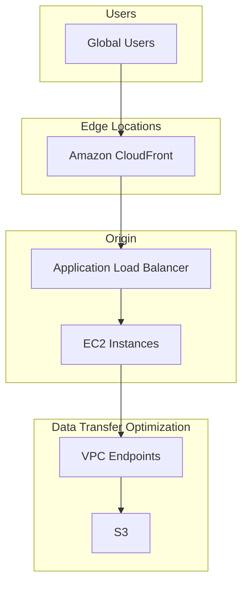

This diagram illustrates a cost-optimized network design. Amazon CloudFront is used to cache content at edge locations, which reduces latency and data transfer costs for global users. VPC endpoints are used to transfer data between the VPC and S3 without going over the internet, which further reduces data transfer costs.

## 6. Essential Exam Tips and Strategies

Passing the AWS SAA-C03 exam requires more than just knowledge of AWS services; it also requires a solid exam-taking strategy. This section provides essential tips and strategies to help you manage your time, understand the questions, and avoid common pitfalls. By following these tips, you can increase your chances of success and walk into the exam with confidence.

### 6.1. Understanding the Question Types

The SAA-C03 exam consists of two types of questions: multiple-choice and multiple-response. It is important to understand the format of each question type so that you can answer them effectively.

#### 6.1.1. Multiple-Choice and Multiple-Response Questions

**Multiple-choice questions** have one correct answer and three incorrect answers (distractors). You need to select the single best answer from the four options. **Multiple-response questions** have two or more correct answers out of five or more options. You need to select all of the correct answers to get credit for the question. There is no partial credit for multiple-response questions, so it is important to be sure of your answers before you submit them.

#### 6.1.2. Scenario-Based Questions

Most of the questions on the SAA-C03 exam are scenario-based. This means that you will be presented with a real-world problem or a business requirement, and you will need to select the most appropriate AWS service or architecture to solve the problem. These questions are designed to test your ability to apply your knowledge to practical situations, rather than just recalling facts. It is important to read the scenario carefully and to identify the key requirements before you start looking at the answer choices.

#### 6.1.3. How to Identify Keywords and Requirements

When you are reading a scenario-based question, it is important to identify the keywords and requirements that will help you to narrow down the answer choices. Look for keywords such as **"most cost-effective," "highly available," "secure," "scalable,"** and **"performant."** These keywords will give you clues about the correct answer. For example, if a question asks for the "most cost-effective" solution, you should look for an answer that uses a low-cost service or a cost-optimization strategy. If a question asks for a "highly available" solution, you should look for an answer that uses a multi-AZ or multi-region deployment.

### 6.2. Effective Time Management

With 130 minutes to answer 65 questions, you have an average of two minutes per question. It is important to manage your time effectively to ensure that you can answer all of the questions within the allotted time.

#### 6.2.1. Pacing Yourself During the Exam

It is important to pace yourself during the exam so that you do not run out of time. If you are stuck on a question, it is better to move on and come back to it later than to spend too much time on it. You can use the "Mark for Review" feature to flag questions that you want to come back to.

#### 6.2.2. The "Mark for Review" Feature

The "Mark for Review" feature is a useful tool for managing your time during the exam. You can use it to flag questions that you are unsure about or that you want to come back to later. At the end of the exam, you can review all of the questions that you have marked and make sure that you have answered them to the best of your ability.

#### 6.2.3. Eliminating Incorrect Answers

If you are unsure of the correct answer to a question, you can try to eliminate the incorrect answers. This can help you to narrow down the choices and increase your chances of selecting the correct answer. Look for answers that are clearly wrong or that do not meet the requirements of the scenario.

### 6.3. Common Pitfalls and How to Avoid Them

There are several common pitfalls that candidates often fall into when taking the SAA-C03 exam. By being aware of these pitfalls, you can avoid them and increase your chances of success.

#### 6.3.1. Over-Engineering Solutions

One common pitfall is over-engineering solutions. This means designing a solution that is more complex or expensive than it needs to be. The exam is looking for the most appropriate solution, not the most complex one. When you are designing a solution, make sure that it is simple, cost-effective, and meets the requirements of the scenario.

#### 6.3.2. Ignoring Cost and Performance Requirements

Another common pitfall is ignoring the cost and performance requirements of the scenario. The exam will often include keywords such as "most cost-effective" or "highly performant." It is important to pay attention to these keywords and to select a solution that meets these requirements. Do not just select the first solution that comes to mind; take the time to evaluate all of the options and to choose the one that is the best fit for the scenario.

#### 6.3.3. Misinterpreting AWS Service Limits

A third common pitfall is misinterpreting AWS service limits. The exam will sometimes include questions that test your knowledge of AWS service limits. It is important to be familiar with the default limits for the most common AWS services, such as EC2, S3, and VPC. If you are unsure of a service limit, you can usually find the answer in the AWS documentation.

## 7. The 2-Week Study Plan (4 Hours Per Day)

This 2-week study plan is designed for individuals who can dedicate 4 hours per day to studying for the SAA-C03 exam. The plan is structured to cover all four domains of the exam in a logical and progressive manner, with a focus on building a strong foundation of knowledge and practical skills. It is important to follow the plan as closely as possible, but you can adjust it to fit your individual learning style and schedule.

### 7.1. Week 1: Building the Foundation

The first week of the study plan is focused on building a strong foundation of knowledge in the first three domains of the exam. Each day, you will cover a specific set of topics and complete a set of practice questions to test your understanding.

#### 7.1.1. Day 1-2: Domain 1 - Design Secure Architectures

*   **Topics to Cover:**
    *   AWS Identity and Access Management (IAM)
    *   Multi-Factor Authentication (MFA)
    *   AWS Single Sign-On (SSO) and Identity Federation
    *   Virtual Private Cloud (VPC) Security
    *   AWS WAF and Shield
    *   AWS Secrets Manager
    *   Data Encryption at Rest and In Transit
    *   AWS Key Management Service (KMS) and AWS Certificate Manager (ACM)
*   **Activities:**
    *   Read the relevant sections of this guide.
    *   Watch video tutorials on the topics covered.
    *   Complete hands-on labs to gain practical experience.
    *   Take a practice quiz on Domain 1.

#### 7.1.2. Day 3-4: Domain 2 - Design Resilient Architectures

*   **Topics to Cover:**
    *   Auto Scaling Groups and Launch Templates
    *   Load Balancing (ALB, NLB, GLB)
    *   Decoupling with SQS, SNS, and EventBridge
    *   Multi-AZ and Multi-Region Deployments
    *   AWS Global Infrastructure
    *   High Availability for Databases
    *   Disaster Recovery Strategies
*   **Activities:**
    *   Read the relevant sections of this guide.
    *   Watch video tutorials on the topics covered.
    *   Complete hands-on labs to gain practical experience.
    *   Take a practice quiz on Domain 2.

#### 7.1.3. Day 5-6: Domain 3 - Design High-Performing Architectures

*   **Topics to Cover:**
    *   Amazon S3 Storage Classes and Performance
    *   EBS Volume Types and Use Cases
    *   EFS and FSx for Shared File Storage
    *   EC2 Instance Families and Sizing
    *   Serverless Compute with AWS Lambda
    *   Container Services: ECS and EKS
    *   Relational and NoSQL Databases
    *   Caching Strategies with ElastiCache
*   **Activities:**
    *   Read the relevant sections of this guide.
    *   Watch video tutorials on the topics covered.
    *   Complete hands-on labs to gain practical experience.
    *   Take a practice quiz on Domain 3.

#### 7.1.4. Day 7: Review and Practice Exam

*   **Activities:**
    *   Review all of the topics covered in Week 1.
    *   Take a full-length practice exam on Domains 1, 2, and 3.
    *   Review your answers and identify areas where you need to improve.

### 7.2. Week 2: Mastering the Concepts

The second week of the study plan is focused on mastering the concepts in the fourth domain of the exam and on taking practice exams to test your knowledge and identify areas where you need to improve.

#### 7.2.1. Day 8-9: Domain 4 - Design Cost-Optimized Architectures

*   **Topics to Cover:**
    *   S3 Lifecycle Policies and Intelligent-Tiering
    *   EBS Snapshots and Archive Storage
    *   Data Transfer Costs and Optimization
    *   EC2 Pricing Models
    *   Right-Sizing Instances with Compute Optimizer
    *   Using Lambda to Reduce Compute Costs
    *   RDS and Aurora Pricing Models
    *   DynamoDB On-Demand vs. Provisioned Capacity
    *   VPC Endpoints to Reduce Data Transfer Costs
*   **Activities:**
    *   Read the relevant sections of this guide.
    *   Watch video tutorials on the topics covered.
    *   Complete hands-on labs to gain practical experience.
    *   Take a practice quiz on Domain 4.

#### 7.2.2. Day 10-11: Hands-On Labs and Practice Questions

*   **Activities:**
    *   Complete hands-on labs on all four domains of the exam.
    *   Take practice quizzes on all four domains of the exam.
    *   Review your answers and identify areas where you need to improve.

#### 7.2.3. Day 12-13: Full-Length Practice Exams and Review

*   **Activities:**
    *   Take two full-length practice exams.
    *   Review your answers and identify areas where you need to improve.
    *   Focus your studies on the areas where you are weakest.

#### 7.2.4. Day 14: Final Review and Exam Day Preparation

*   **Activities:**
    *   Review all of the topics covered in the exam.
    *   Take a final practice quiz to test your knowledge.
    *   Get a good night's sleep before the exam.
    *   Prepare all of the materials you will need for the exam, such as your identification and your confirmation email.

## 8. Recommended Free and Low-Cost Resources

There are many free and low-cost resources available to help you prepare for the SAA-C03 exam. This section provides a list of some of the best resources that you can use to supplement your studies.

### 8.1. Official AWS Documentation and Whitepapers

The official AWS documentation and whitepapers are the most authoritative sources of information on AWS services and best practices. They are a must-read for any candidate preparing for the SAA-C03 exam. Some of the most important whitepapers to read include:

*   AWS Well-Architected Framework
*   AWS Security Best Practices
*   AWS Storage Services Overview
*   AWS Compute Services Overview
*   AWS Database Services Overview

### 8.2. AWS Free Tier and Hands-On Labs

The AWS Free Tier is a great way to gain hands-on experience with AWS services without incurring any costs. You can use the Free Tier to create and configure AWS resources, and to experiment with different services and features. There are also many free hands-on labs available online that can help you to learn about AWS services in a practical way.

### 8.3. Community Forums and Study Groups

Community forums and study groups can be a great way to connect with other candidates and to share knowledge and resources. You can ask questions, get help with difficult topics, and learn from the experiences of others. Some of the most popular community forums and study groups include:

*   AWS subreddit
*   AWS Discord server
*   AWS Certified Global Community on LinkedIn

### 8.4. Practice Exam Platforms

There are many practice exam platforms available online that can help you to prepare for the SAA-C03 exam. These platforms offer a variety of practice questions and exams that are designed to simulate the real exam experience. Some of the most popular practice exam platforms include:

*   AWS Skill Builder
*   Tutorials Dojo
*   Whizlabs
*   A Cloud Guru
